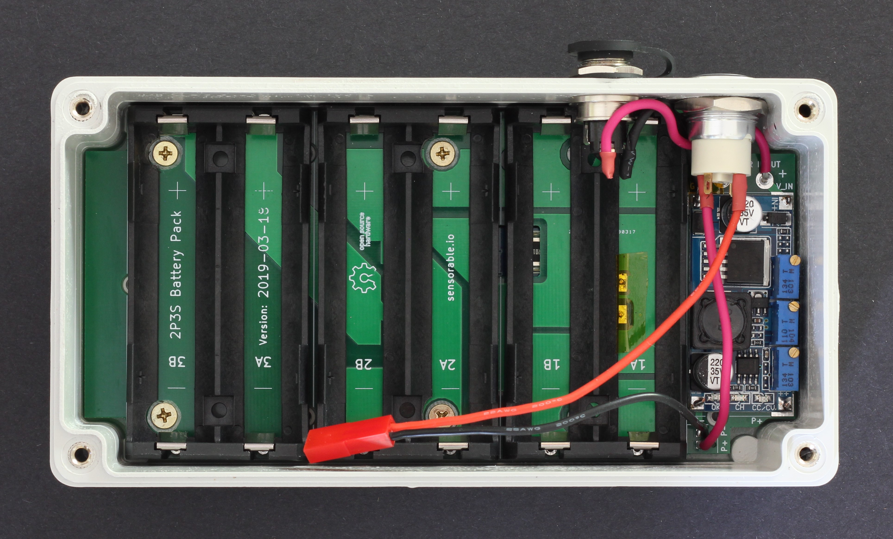
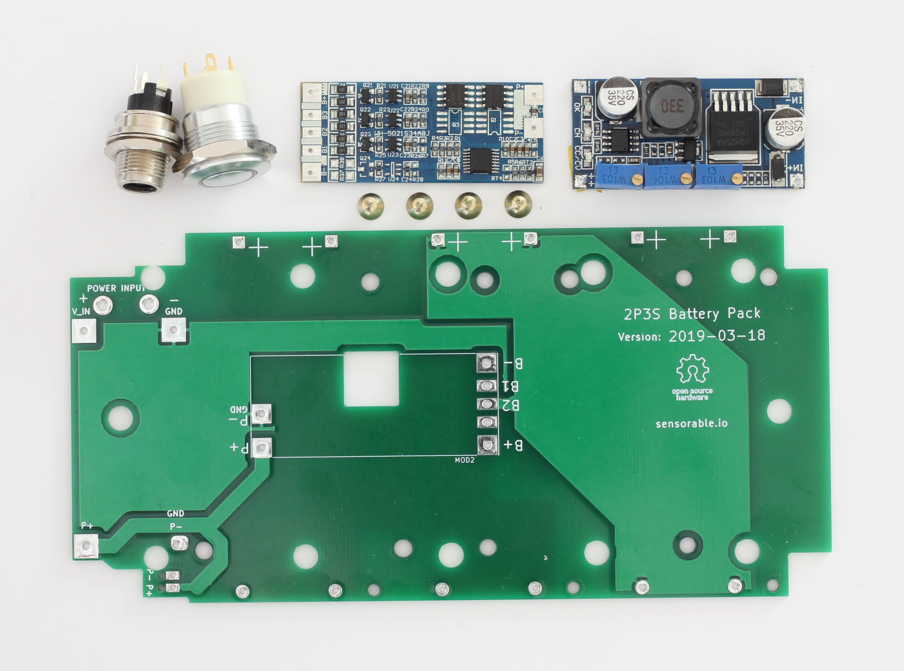

# 2P3S Battery Pack
### Designed for use with Sensorable Open Source Cameras

## Specification

* Charging voltage: 14v ... 36v
* Output voltage: 9.3v ... 12.6v
* Batteries: Li-Ion 18650 x3 or x6
* Operational temp: 0C ... 40C
* Enclosure: RP1170
* Water ingress: IP65 with a breathable valve
* Size: 165mm x 86mm x 40mm

## Overview

This battery pack combines several COTS components to allow short production runs with manual assembly. All components are "though-hole" and the whole unit can be ordered and put together by any sufficiently skilled individual. It is not suitable for an automated PCBA process or large production runs.

Charging sources:

* a laptop charger with a barrel connector
* an intermittent power source like street lights, via a transformer
* a solar panel, but the efficiency can be low due to lack of MPPT

**Restarting the pack**

1. Insert the batteries
2. Connect a charger for a brief moment

The BMS requires external voltage close to the pack output to be connected from the outside for it to start working. You need to connect a charger or any similar source of voltage if you removed and re-inserted the batteries.

## Batteries

**Use only high quality Li-Ion 18650 batteries from a trusted manufacturer, e.g. NCR18650B and NCR18650GA from Panasonic.**

The battery holders are connected as 2P-3S, that is, the 2 batteries in the same holder are connected in parallel and the holders are connected in series. This way you can use either 3 or 6 battery cells.

* 3-cell configuration: place one battery into each holder numbered 1,2,3
* 6-cell configuration: fill in all available slots

The charger unit has to be adjusted to the battery type and the size of the pack. Use the 2 blue potentiometers to set the voltage to 4.2v and limit the current to less than 1A, if using NCR18650GA. Check your battery datasheet if using a different type.

The batteries are protected with a commercial BMS module with load balancing. Use only new batteries from the same batch and at exactly the same voltage. The load balancing feature will maintain them in that state, but it will not balance out mismatched batteries.

**BMS spec from the manufacturer datasheet:**
* Charging voltage: 12.6v
* Balance voltage per cell: 4.2v
* Balance current per cell: 42mA
* Max discharge current: 4.5A
* Overcharge protection: 4.35v +/-0.025v
* Overdischarge protection: 2.7v per cell

## Ordering and assembly

1. See the BOM file for the list of components and suppliers
2. We used JLCPCB for making the PCBs with a good result
3. Use cutting and drilling templates from the repo to modify the enclosure

## Enclosure assembly instructions

* Trim the breathable valve by 4mm if placed on the back face under the board. Insert the valve from the inside of the case, tighten the nut back side out, cut off the white plastic flush to the nut.
* Counter-sink post to match the board counter-sinks 
* Mark holes for the switch and PWR IN.
* Check that the holes are marked correctly in relation to the countersunk holes and the vent.

